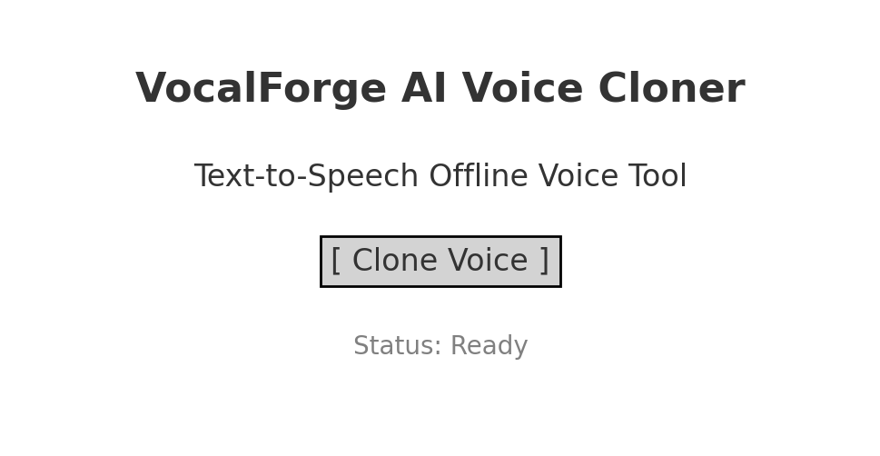

<p align="center">
  
  
  
</p>

# EchoForge - AI Voice Cloner GUI

**EchoForge** is a free, offline AI voice cloning interface designed for content creators, meme editors, voiceover artists, and AI enthusiasts.  
No GPU required. No cloud processing. Everything runs locally on your machine.

---



## Features

- AI-based voice cloning with TTS capabilities
- Real-time voice preview with waveform rendering
- Offline mode (no data leaves your machine)
- Clean and intuitive GUI
- Lightweight and fast — no GPU required

## How it Works

EchoForge wraps a precompiled local inference engine inside a Python GUI.  
No training is required — just run the interface, enter your input, and get results instantly.

## Installation

```bash
pip install -r requirements.txt
python echo_gui.py
```

---

## Frequently Asked Questions (FAQ)

**Q: Does this tool collect or send data online?**  
A: No. Everything runs offline and locally.

**Q: Can I use this for TikTok voice memes?**  
A: Yes! EchoForge is optimized for fast, local audio synthesis — perfect for meme workflows.

**Q: Do I need a powerful PC or GPU?**  
A: Not at all — it runs on most systems, even laptops without dedicated graphics.

---

## SEO Keywords

> For better discoverability

```
ai voice cloning  
offline voice changer  
text to speech AI GUI  
voice cloning tool github  
local tts clone  
tiktok ai voice meme  
python voice assistant offline
```

---

## License

MIT License – For educational, experimental and personal use only.
